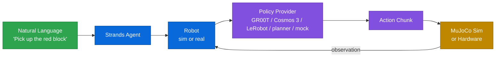

[Strands Robots](https://github.com/strands-labs/robots) gives a Strands Agent
hands. One `Robot()` call returns a **MuJoCo simulation** (the default - no GPU,
no hardware) or a **real robot** - same code, same natural-language control, both
auto-joined to a peer-to-peer **mesh**.

```python
from strands import Agent
from strands_robots import Robot

robot = Robot("so100")              # MuJoCo sim by default; mode="real" for hardware
Agent(tools=[robot])("pick up the red cube")
```

The full documentation - guides, the robot catalog, policy references, and the
hardware setup walkthroughs - lives at
[strands-labs.github.io/robots](https://strands-labs.github.io/robots/).

## Getting started

Examples use [`uv`](https://docs.astral.sh/uv/); plain `pip` works too. The base
install is light (numpy, opencv-headless, Pillow) - pull in only the extras you
need.

```bash
# Most users start here (simulation, no GPU, no hardware):
uv pip install "strands-robots[sim-mujoco]"

# Real hardware + local policies:
uv pip install "strands-robots[sim-mujoco,lerobot]"

# Everything (except the GPU-only extras):
uv pip install "strands-robots[all]"
```

| Extra | Use for |
|-------|---------|
| `sim-mujoco` | MuJoCo simulation (recommended starting point) |
| `sim-newton` / `sim-isaac` / `sim-gs` | GPU-native, photoreal, and Gaussian-splatting rendering backends |
| `lerobot` | Real hardware, local VLA inference, dataset recording |
| `groot-service` / `cosmos3-service` | NVIDIA GR00T / Cosmos 3 inference clients |
| `mesh` / `mesh-iot` | Peer-to-peer robot mesh (+ AWS IoT Core for fleets) |
| `all` | Kitchen sink (except GPU-only `sim-isaac` / `sim-gs`) |

See the [full extras matrix](https://strands-labs.github.io/robots/) for the
complete list (`molmoact2`, `curobo`, `wbc`, `motionbricks`, `benchmark-libero`,
and more).

### Simulation (no GPU, no hardware)

```python
from strands import Agent
from strands_robots import Robot

robot = Robot("so100")  # MuJoCo simulation
agent = Agent(tools=[robot])
agent("Wave the arm using the mock policy for 200 steps, then render a top-down view")
```

`Robot("so100")` returns a `Simulation` instance - the full simulation
AgentTool. Drive it in natural language through an `Agent`, call its methods
directly (`robot.render(camera_name="topdown")`), or dispatch an action by
calling it (`robot(action="render", camera_name="topdown")`).

:::note[World already exists]
`Robot("so100")` already creates the world **and** adds the robot for you. Do
**not** call `create_world()` again on the returned instance - it errors with
*"World already exists."*
:::

### Real hardware + GR00T

```python
from strands import Agent
from strands_robots import Robot, gr00t_inference

robot = Robot(
    "so101",
    mode="real",
    cameras={
        "front": {"type": "opencv", "index_or_path": "/dev/video0", "fps": 30},
        "wrist": {"type": "opencv", "index_or_path": "/dev/video2", "fps": 30},
    },
    port="/dev/ttyACM0",
    data_config="so100_dualcam",
)

agent = Agent(tools=[robot, gr00t_inference])

# Start the GR00T inference service (Docker, Jetson/x86 GPU)
agent.tool.gr00t_inference(
    action="start",
    checkpoint_path="/data/checkpoints/model",
    port=8000,
    data_config="so100_dualcam",
)

agent("Use so101 to pick up the red block with the GR00T policy on port 8000")
```

## One agent, the whole robotics loop

Teleoperate a real arm to collect demos, fine-tune a policy on them, run it in
sim **and** on hardware, hand work to a fleet peer, and expose it all on ROS 2 -
one library, one mental model.

```python
from strands import Agent
from strands_robots import Robot
from strands_robots.tools import train_policy

# 1. TELEOPERATE a real SO-101 with its leader arm and RECORD demos as a
#    LeRobotDataset (one prompt drives cameras + teleop + recording).
follower = Robot("so101", mode="real", port="/dev/ttyACM0",
                 cameras={"front": {"type": "opencv", "index_or_path": "/dev/video0"}})
follower.attach_teleop("so101_leader", port="/dev/ttyACM1", id="leader")
Agent(tools=[follower])(
    "start_recording(repo_id='me/pick', root='/tmp/pick', fps=30, "
    "task='pick up the cube'); teleoperate for 60s; stop_recording"
)

# 2. POST-TUNE a policy on those demos (LoRA fine-tune; GPU box).
train_policy(action="train", provider="lerobot_local",
             dataset_root="/tmp/pick", base_model="lerobot/smolvla_base",
             output_dir="/tmp/pick_ckpt", method="lora", steps=20000)

# 3. RUN the tuned checkpoint - same policy on a MuJoCo twin AND the real arm.
twin = Robot("so101")                                              # sim twin, no hardware
twin.run_policy(robot_name="so101", policy_provider="lerobot_local",
                policy_config={"pretrained_name_or_path": "/tmp/pick_ckpt"}, duration=10.0)
follower.start_task("pick up the cube", policy_provider="lerobot_local",
                    policy_port=None, duration=10.0)               # real arm, in-process

# 4. COORDINATE a fleet - tell a mesh peer to assist, in natural language.
follower.mesh.tell(follower.mesh.peers[0]["peer_id"], "hold the tray steady")

# 5. EXPOSE the running sim on ROS 2 - rviz / nav2 / any ros2 node can subscribe.
from strands_robots.simulation import Simulation
sim = Simulation(ros2_bridge=True); sim.create_world(); sim.add_robot("so101")
sim.step(100)   # publishes /so101/joint_states + camera image_raw on the ROS 2 graph
```

| Step | Capability | Surface |
|------|------------|---------|
| 1 | Teleop + dataset recording | `Robot(mode="real")`, `attach_teleop`, `start_recording` |
| 2 | Policy post-tuning | `train_policy` (LeRobot / GR00T trainers) |
| 3 | Sim + hardware policy rollout | `run_policy` (sim), `start_task` (hardware) |
| 4 | Fleet coordination | `robot.mesh.tell` / `robot_mesh` tool |
| 5 | ROS 2 interop | `Simulation(ros2_bridge=True)`, `use_ros` |

Steps 1 and 3-real need hardware; step 2 needs a GPU. Everything runs in sim with
no hardware (`Robot("so101")`), so you can exercise the whole loop today.

## Why strands-robots

- **Sim-first, safe by default.** `Robot("so100")` spins up a MuJoCo world. You
  never accidentally drive real servos - `mode="real"` is an explicit opt-in.
- **50+ robots, 8 categories.** Arms, humanoids, quadrupeds, hands, drones, and
  bimanual rigs - resolved from a single registry with auto-download of assets.
- **Any policy.** VLA models (NVIDIA GR00T, LeRobot ACT/Pi0/SmolVLA/Diffusion),
  plus classical motion planners, MPC, and scripted controllers behind one ABC.
- **Mesh networking built in.** Every robot is a Zenoh peer. `tell()` another
  robot what to do; broadcast an E-STOP; bridge to AWS IoT Core for fleets.
- **ROS 2 interop.** Observe + command any ROS 2 graph (`use_ros`), act as a
  robot with no rclpy (`use_rtps`), or expose a running sim as a ROS node.
- **One mental model.** Sim and hardware share the same policy interface, the
  same mesh, and the same natural-language control surface.

## How it works



Each control cycle, the robot captures observations (camera frames and joint
states), sends them to the policy for inference, receives an action chunk, and
executes those actions in the sim or on hardware.

## The `Robot()` factory

`Robot()` is a factory, not a wrapper - you get the real backend instance back
with all its methods.

```python
Robot("so100")                       # mode="sim"  (default, safe)
Robot("so100", mode="real")          # explicit hardware opt-in
Robot("so100", mode="auto")          # probe USB for servos, fall back to sim
Robot("my_arm", urdf_path="arm.xml") # bring your own MJCF/URDF
```

| Parameter | Type | Default | Description |
|-----------|------|---------|-------------|
| `name` | `str` | required | Robot name or alias |
| `mode` | `str` | `"sim"` | `"sim"`, `"real"`, or `"auto"` (case-insensitive) |
| `backend` | `str` | `"mujoco"` | Sim backend: `"mujoco"`, `"newton"`, or `"isaac"` |
| `urdf_path` | `str` | `None` | Explicit MJCF/URDF path (skips registry lookup) |
| `cameras` | `dict` | `None` | Camera config (**`mode="real"` only**) |
| `data_config` | `str` | name | Observation/action schema name |
| `mesh` | `bool` | `True` | Auto-join the Zenoh mesh |

Safety rules: defaults to sim; `cameras=` is rejected in sim mode (add sim
cameras with the `add_camera` action); unknown names raise `ValueError` unless
you pass `urdf_path=`; `STRANDS_ROBOT_MODE` overrides detection.

## Supported robots

50+ robots across 8 categories, resolved from the registry. Assets (MJCF +
meshes) auto-download from
[robot_descriptions](https://github.com/robot-descriptions/robot_descriptions.py)
/ [MuJoCo Menagerie](https://github.com/google-deepmind/mujoco_menagerie) on
first use. List them at runtime with
`from strands_robots import list_robots; list_robots()`.

| Category | Count | Examples |
|----------|-------|----------|
| **Arm** | 22 | so100, so101, koch, panda, fr3, ur5e, xarm7, kinova_gen3, kuka_iiwa |
| **Humanoid** | 18 | unitree_g1, unitree_h1, apollo, talos, reachy2, booster_t1, cassie |
| **Mobile** | 13 | spot, go1, unitree_go2, anymal_c, stretch3, lekiwi, earthrover |
| **Hand** | 8 | shadow_hand, allegro_hand, leap_hand, ability_hand, robotiq_2f85 |
| **Bimanual** | 3 | aloha, bi_openarm, trossen_wxai |
| **Aerial** | 2 | crazyflie, skydio_x2 |
| **Expressive** | 1 | reachy_mini |
| **Mobile manip** | 1 | google_robot |

**Hardware-capable** (drivable with `mode="real"` via LeRobot): `so100`,
`so101`, `koch`, `omx`, `hope_jr`, `aloha`, `bi_openarm`, `reachy2`,
`unitree_g1`, `lekiwi`, `earthrover`. All are simulatable. See the
[full robot catalog](https://strands-labs.github.io/robots/).

## Tools reference

Import any of these and pass to `Agent(tools=[...])`. Each is a Strands
AgentTool returning `{"status", "content"}`.

| Tool | Purpose |
|------|---------|
| `Robot(...)` | Universal robot - sim or hardware, natural-language + async control |
| `run_policy` | Multi-episode policy rollout with per-episode eval + dataset recording |
| `train_policy` | Post-tune (fine-tune) a policy on a recorded dataset |
| `use_lerobot` | Universal LeRobot bridge - call any lerobot module/class/config directly |
| `robot_mesh` | Coordinate robots over the Zenoh mesh (`tell`, `broadcast`, E-STOP) |
| `use_ros` / `use_rtps` | Bridge to / join a ROS 2 graph (in-process rclpy, or pure DDS) |
| `gr00t_inference` | Manage NVIDIA GR00T inference services (Docker lifecycle) |
| `lerobot_camera` | OpenCV / RealSense camera discovery, capture, record |
| `lerobot_calibrate` | List, view, back up, restore LeRobot calibrations |
| `lerobot_teleoperate` | Record demonstrations, replay episodes |
| `pose_tool` | Store, recall, and execute named robot poses |
| `serial_tool` | Low-level Feetech servo / raw serial communication |
| `download_assets` | Pre-fetch robot MJCF + meshes into the asset cache |

## Policy providers

All policies implement one ABC -
`async get_actions(observation, instruction, **kwargs)`. The interface is
deliberately agnostic about *how* actions are produced, so it fits both VLA
models and classical controllers.

```python
from strands_robots import create_policy

create_policy("mock")                                    # sinusoidal test actions
create_policy("groot", port=5555)                        # NVIDIA GR00T via ZMQ
create_policy("cosmos3", embodiment="droid", port=8000)  # NVIDIA Cosmos 3 via WebSocket
create_policy("lerobot/act_aloha_sim_transfer_cube")     # local HuggingFace inference
```

| Provider | Backend | Notes |
|----------|---------|-------|
| `mock` | none | Sinusoidal trajectories; no images needed (~10x faster) |
| `groot` | NVIDIA GR00T N1.5/N1.6/N1.7 | ZMQ service or local in-process |
| `cosmos3` | NVIDIA Cosmos 3 | WebSocket to a Cosmos policy server |
| `lerobot_local` | HuggingFace | Direct ACT / Pi0 / SmolVLA / Diffusion inference |
| `lerobot_async` / `remote` | HuggingFace / any | Offload to a remote `PolicyServer` (gRPC or WebSocket) |

See the [policies reference](https://strands-labs.github.io/robots/) for the
full provider list, plus motion-planning policies (`moveit2`, `curobo`),
whole-body control (`wbc`), and `motionbricks`.

## Teleoperation

Drive any real robot - or a simulation - from one or more LeRobot teleoperators.
`Teleoperator()` mirrors the `Robot()` factory; `attach_teleop()` +
`teleoperate()` run the control loop.

```python
from strands_robots import Robot

# Leader arm -> follower arm (both speak {motor}.pos -> zero config)
follower = Robot("so101", mode="real", port="/dev/ttyACM0")
follower.attach_teleop("so101_leader", port="/dev/ttyACM1", id="leader")
follower.teleoperate()                       # Ctrl+C or stop_teleoperate()
```

17 teleoperators drive 14 robots. Zero-config when action keys match; otherwise
pass `map_fn`. Full matrix + recipes:
[Teleoperation docs](https://strands-labs.github.io/robots/hardware/teleoperation/).

## Recording & streaming datasets

The physical-AI data loop, end to end: **record** a LeRobotDataset from sim or
hardware, **stream** it straight back for eval/training (no full download), and
optionally **dump** it to a mutable Hugging Face Storage Bucket. Needs the
`lerobot` extra.

```python
from strands import Agent
from strands_robots import Robot

sim = Robot("so100", mesh=False)
agent = Agent(tools=[sim])

# COLLECT - one natural-language prompt drives scene + cameras + policy + record.
agent(
    "Create a world with the so100 robot, add a red cube and a front camera, "
    "start recording (repo_id='local/demo', root='/tmp/demo', fps=30, "
    "overwrite=True, task='pick up the red cube'), run the mock policy for "
    "60 steps, then stop recording."
)

# STREAM - read it back lazily; camera frames decode on the fly from the MP4
# shards, state/action from parquet. Nothing is re-materialized to disk.
reader = sim.stream_dataset("local/demo", root="/tmp/demo", shuffle=False)
```

:::note[Verify episode integrity]
A recording's ground truth is the parquet under `meta/episodes/`, not the count
a model narrates while collecting. Confirm the dataset holds the episodes you
intended with `sim.verify_dataset_episodes(expected=20)` (or
`strands-robots verify-dataset /tmp/demo --expected 20` in CI). This catches the
"mega-episode" corruption class and `meta/info.json` vs parquet drift.
:::

## Links

- [Documentation](https://strands-labs.github.io/robots/)
- [GitHub repository](https://github.com/strands-labs/robots)
- [PyPI package](https://pypi.org/project/strands-robots/)
- [Strands for Cosmos](strands-for-cosmos.md) - world models: physics-aware video/action generation
- [NVIDIA Isaac GR00T](https://github.com/NVIDIA/Isaac-GR00T)
- [LeRobot](https://github.com/huggingface/lerobot)
