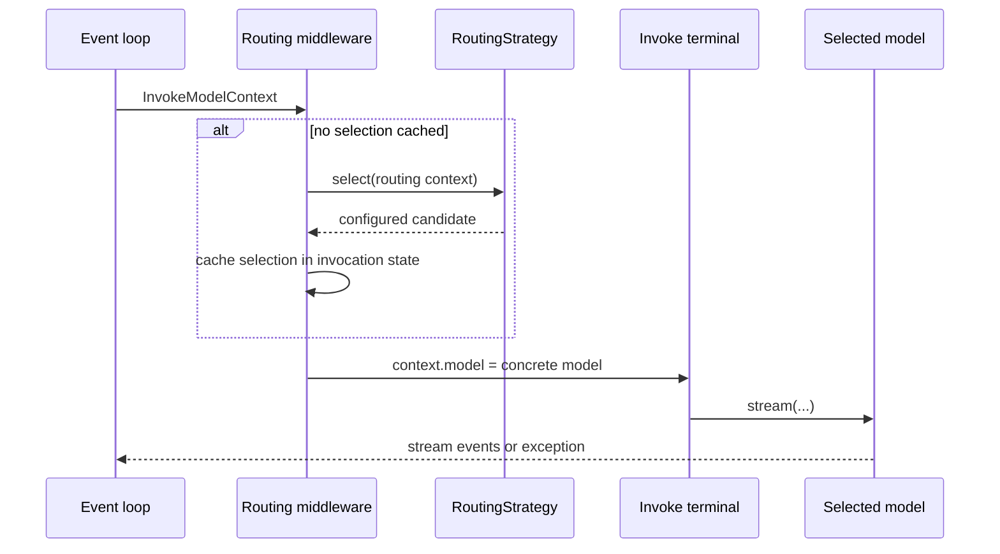

# Model Routing

**Status**: Proposed

**Date**: 2026-07-10

**Issue**: [#364](https://github.com/strands-agents/harness-sdk/issues/364)

**Scope**: Python SDK (the same shape ports to the TypeScript SDK later)

## Overview

Today a Strands `Agent` holds exactly one `Model`. It is resolved once in the constructor, and every inference call goes through that one `agent.model`. The model is fixed at build time.

Model routing lets an agent choose *which model handles a call* at runtime, based on the request, the conversation, cost, availability, or the phase of work. This matters more now that frontier models cost roughly 5x to 10x what smaller ones do, so sending easy turns to a small model is a real saving. Customers have asked for it directly ([#364](https://github.com/strands-agents/harness-sdk/issues/364)).

## Goals and Non-Goals

Goals:
- Make model choice a runtime decision, opt-in, with single-model usage unchanged.
- Provide a small strategy interface for proactive selection that composes with ordered fallback.
- Route among `Model` instances, including models backed by different providers.
- Ship failure-driven fallback, a local heuristic, and one model-driven strategy in v1, so the feature is useful on its own.

Non-Goals (v1):
- Load balancing across deployments of the same model. This needs a global view of traffic and belongs in a gateway.
- Classifier or semantic routing, quality cascades, and cost-aware routing. These are fast-follow; cost is blocked on per-model pricing the SDK does not carry yet.
- Response caching. A cache hit skips the model call entirely, so it sits in front of routing, not inside it.

## Prior Art

| Framework | Where it runs | Decision signal | Idea to adapt |
|---|---|---|---|
| [LiteLLM Router](https://docs.litellm.ai/docs/routing) | Client / proxy across deployments | Load, cooldowns, cost/latency weights, ordered fallbacks | Ordered fallback as a baseline |
| [LangChain](https://python.langchain.com/docs/how_to/routing) | Composable wrappers | Conditional branch; ordered fallbacks | Fallback as a composable wrapper |
| [Portkey](https://portkey.ai/docs/product/ai-gateway-streamline-llm-integrations/fallbacks) | Gateway | Nestable conditional / load-balance / fallback | Strategies should nest |
| [RouteLLM](https://arxiv.org/html/2406.18665v2) | Client (research) | Learned classifier on query complexity | Reference for classifier routing |
| [Pydantic-AI `FallbackModel`](https://ai.pydantic.dev/api/models/fallback/) | Model wrapper | Ordered model list, falls through on failure | Fallback fits a typed SDK cleanly |
| [Bedrock Intelligent Prompt Routing](https://docs.aws.amazon.com/bedrock/latest/userguide/prompt-routing.html) | Server-side endpoint | Predicted per-request quality in a family | Server-routed endpoints are just candidates |

The intersection worth taking is small: client-side model selection with fallback and proactive strategies. Fallback is the one mechanism every framework ships, which makes it the safe first build.

## Scope

Routing decides among concrete **`Model` instances** in the SDK. Selection defaults to once per agent invocation: the first model call stores the chosen candidate in invocation-scoped state, and later model calls reuse it unless fallback advances the route. During construction, a router normalizes its candidates and recursively rejects any model with `stateful=True`, raising `ValueError` before an agent can use an invalid topology. Switching stateful models would break provider-managed conversation state.

**The unit of routing is a `Model`.** A concrete `Model` is already the amalgamation of provider and model: it encapsulates the provider, its model id, region, and configuration, which is the typed-SDK equivalent of the `provider/model` string that LiteLLM and OpenRouter route over. Candidates can therefore represent models on one provider (`BedrockModel("haiku")`, `BedrockModel("sonnet")`), the same model through different providers (`BedrockModel("sonnet")`, `AnthropicModel("sonnet")`), regional copies, or configuration variants. A server-routed endpoint such as Bedrock intelligent prompt routing is likewise one candidate `Model`. The router does not parse `provider/model` strings itself; resolving such a string to a `Model` is a model-construction concern that the router consumes as a candidate. Traffic-aware load balancing across a deployment pool remains gateway territory because it needs a fleet-wide view.

Three strategies ship in v1, chosen so each of the objectives the SDK can act on today has a working strategy:

| Strategy | Objective | Trigger | Basis |
|---|---|---|---|
| Fallback | availability/reliability | reactive | router-owned ordered candidates; retry the selected model, then advance. Reuses `ModelRetryStrategy` |
| Context-fit | capacity | proactive | `count_tokens` and `context_window_limit`; local, with no extra model call |
| Model-driven | quality/accuracy | proactive | a small decision model classifies the request and names a candidate |

The remaining objectives are covered by candidate selection or deferred for a missing signal, not left unaddressed:
- **Compliance/residency** is expressed by which models a caller lists (for example, only models in an approved region), so it needs no dedicated strategy.
- **Cost** is a proactive strategy blocked on per-model pricing, which the SDK does not carry yet (P1).
- **Latency** needs runtime latency measurement or shared state, which is closer to the gateway load-balancing case the SDK delegates (P1).

Proactive selection and fallback compose without requiring every strategy to implement failure handling. A strategy chooses the initial candidate. After that candidate's retries are exhausted, `ModelRouter` tries each untried candidate in declaration order.

## Proposal

An `Agent` receives its model through `model=`, and every inference call currently reaches that model through `InvokeModelStage`. Routing belongs in this existing stage because it prepares and owns the model invocation. A separate routing stage would split one operation across two lifecycle boundaries without adding a useful interception point.

**Recommended: widen `model=` to `Model | ModelRouter`, and select through `InvokeModelStage` middleware.** `ModelRouter` is its own type, not a `Model`, and implements `Plugin`. During initialization, `Agent` recognizes a router passed through `model=`, registers the plugin, and resolves `agent.model` to the router's first concrete candidate. Plain `Model` initialization remains unchanged.

`Plugin` is the attachment lifecycle, not the routing mechanism. It does not auto-register middleware; the router registers its `InvokeModelStage.Input` handler from `init_agent()`, the same way the built-in `ContextInjector` and memory injection register their input middleware today. Selection is middleware, fallback is a hook, and both are installed by the one plugin.

```python
agent = Agent(model=ModelRouter(models=[...], strategy=...))
```

`InvokeModelContext` gains a `model: Model` field initialized from `agent.model`. The router's input middleware selects a candidate on the first call, stores the selected candidate in `invocation_state`, and replaces `context.model`. Later calls in the same invocation reuse that selection. If a candidate is another router, resolution continues until the context contains a concrete `Model`.

The existing invoke terminal reads `context.model` instead of `agent.model`, then performs the model call exactly as it does today. It retains ownership of streaming, model state, tracing, and errors. The selected model is therefore known before the model-invoke span starts, without creating a second call site or mutating shared agent state.



**Reactive fallback** uses the existing retry path and is owned by `ModelRouter`, not individual selection strategies. The router registers its fallback callback after `ModelRetryStrategy` in hook priority. While the retry strategy sets `event.retry`, the router keeps the selected candidate. Once that model's retries are exhausted, the router records the next untried candidate in declaration order, resets the retry budget, and requests another attempt. When the event loop re-enters `InvokeModelStage`, middleware resolves the updated candidate rather than running initial selection again. Per-invocation routing state keeps concurrent invocations independent.

Alternatives are in [Alternatives Considered](#alternatives-considered).

## Developer Experience

Routing is opt-in through `model=`. Pass a `Model` for today's behavior, or a `ModelRouter` to route. Models, candidates, and strategies are configured once, then reused across invocations. A router may also be shared by multiple agents because its topology is immutable and all selection state lives in invocation or agent state.

A configured `Model` remains the source of provider, model id, region, inference parameters, and context capacity. Routing does not duplicate those dimensions. `RoutingCandidate` adds only the stable name and task description that a semantic strategy needs. Plain `Model` objects and model-id strings remain shorthand for strategies such as fallback and context-fit that do not need candidate descriptions.

```python
haiku  = BedrockModel(model_id="anthropic.claude-3-5-haiku-20241022-v1:0")
sonnet = BedrockModel(model_id="anthropic.claude-3-5-sonnet-20241022-v2:0")
opus   = AnthropicModel(model_id="claude-opus-4-1")
judge  = BedrockModel(model_id="amazon.nova-micro-v1:0")

# Fallback: configure once, then reuse for every invocation.
fallback = ModelRouter(models=[sonnet, opus], strategy=FallbackStrategy())
agent = Agent(model=fallback)

# Context-fit: local selection with no additional model call.
context_fit = ModelRouter(models=[haiku, sonnet, opus], strategy=ContextFitStrategy())
agent = Agent(model=context_fit)

# Model-driven: the judge picks a named candidate from reusable descriptions.
model_driven = ModelRouter(
    models=[
        RoutingCandidate(
            name="routine",
            model=haiku,
            description="Direct questions, extraction, summarization, and simple tool use.",
        ),
        RoutingCandidate(
            name="complex",
            model=opus,
            description="Ambiguous requests or multi-step reasoning requiring higher capability.",
        ),
    ],
    strategy=ModelDrivenStrategy(judge=judge),
)
support_agent = Agent(model=model_driven)
research_agent = Agent(model=model_driven)  # the same profile can serve another agent

# Single-model usage is unchanged.
agent = Agent(model=sonnet)
```

The judge runs only for initial selection and the result is cached for the invocation, so tool-loop calls do not pay another routing call. Model-driven routers require unique, non-empty candidate names and descriptions. The strategy validates the judge's output against that set. An unknown or malformed result, parse failure, or judge-call failure selects the router's first candidate and records the routing failure in tracing. Ordered fallback still applies if that candidate later fails. Applications that do not want a judge call use a local strategy such as context-fit or provide their own `RoutingStrategy`.

Routers can nest when each level has a different responsibility. Resolution is recursive and always produces a concrete model before the terminal runs:

```python
adaptive = ModelRouter(models=[haiku, sonnet], strategy=ContextFitStrategy())
agent = Agent(model=ModelRouter(models=[adaptive, opus], strategy=FallbackStrategy()))
```

In v1, a strategy that depends on model metadata ranks concrete models only. An order-based parent such as `FallbackStrategy` may contain nested routers; metric-based ranking of nested groups needs aggregate metadata and is deferred.

## Interface Design

The public names in this section are provisional and subject to change during API review. The responsibilities and boundaries are the proposal.

```python
@dataclass(frozen=True)
class RoutingCandidate:
    model: Model | str | "ModelRouter"
    name: str | None = None
    description: str | None = None

CandidateInput = Union[Model, str, "ModelRouter", RoutingCandidate]

@dataclass(frozen=True)
class RoutingContext:
    messages: Messages
    system_prompt: SystemPrompt
    tool_specs: tuple[ToolSpec, ...]
    candidates: tuple[RoutingCandidate, ...]
    invocation_state: Mapping[str, Any]

class RoutingStrategy(Protocol):
    name: str

    async def select(self, context: RoutingContext) -> RoutingCandidate: ...

class ModelRouter(Plugin):
    def __init__(self, models: Sequence[CandidateInput],
                 strategy: RoutingStrategy): ...

Agent(model: Model | str | ModelRouter = ...)
```

- `ModelRouter` normalizes each input into a `RoutingCandidate`. Bare models, model-id strings, and nested routers need no public name because strategies return one of the candidate objects in `RoutingContext`, not a string identifier.
- `RoutingCandidate` adds optional selection metadata, not another model configuration. `ModelDrivenStrategy` requires explicit unique names and descriptions so the judge has a classification contract; fallback and context-fit do not.
- The first declared candidate is the concrete default. This removes string-based default resolution and makes fallback order visible in the constructor call.
- A strategy must return one of `context.candidates`; the router raises a clear `ValueError` for any other result. The strategy remains a domain `Protocol` rather than a `HookProvider` because `ModelRouter` owns lifecycle registration and the strategy has one decision point.
- `RoutingContext` exposes immutable views of the request data and normalized candidates needed for selection. Context-fit calls each concrete candidate's `count_tokens` and compares the result with that candidate's `context_window_limit`.
- `ModelRouter` topology and strategy configuration are immutable after construction. The same router can be attached to multiple agents; selections and fallback position live in `invocation_state`, and future session affinity lives in the receiving agent's state.
- `InvokeModelContext.model` always contains a concrete `Model` when the terminal runs.
- Candidate normalization recursively rejects stateful models during `ModelRouter` construction with an actionable `ValueError`.
- Agent invocations using `structured_output_model` pass through `InvokeModelStage` and reuse the invocation's selection. The deprecated direct `Agent.structured_output()` path bypasses this stage and uses the first candidate.

`ContextFitStrategy` uses context capacity only. It chooses the smallest known context window that fits that candidate's token count and falls back to the largest known window when none fit. It does not depend on cost metadata.

## Work Plan

- **P0, router core and fallback.** Add immutable, reusable `ModelRouter` and `RoutingCandidate` configuration; normalize candidate inputs; widen `model=`; recognize the router as a plugin during agent initialization; add `model` to `InvokeModelContext`; cache selection in invocation state; resolve nested routers; and make the terminal call the context model. Register routing before model-dependent invoke middleware, provide router-owned ordered fallback after `ModelRetryStrategy`, reset retry state when advancing, and reject stateful candidates during construction.
- **P0, context-fit and model-driven strategies.** Add local context-window selection and decision-model selection over named candidate descriptions. Run the judge once per invocation, fall back to the first candidate when the judge fails or returns an invalid result, and record the outcome on the existing model-invoke span.
- **P1, cost-aware routing.** Add a pricing source of truth, then rank context-fit survivors by price.
- **P1, cache-affinity (sticky) routing.** When a request carries prompt-cache points, keep it on the model that wrote the cache so a cheaper route does not discard a cache hit. This is a session-scoped selection stored in agent state and matches LiteLLM's prompt-cache routing pre-call check.
- **P1, classifier, semantic routing, and quality cascades.** Add learned or embedding selection without a decision-model call, and result-aware escalation once the SDK exposes a suitable quality signal.

## Alternatives Considered

- **Router is a `Model`, passed as `model=`.** This keeps `Agent` unchanged and makes routing look like any other model call. Rejected: the router would have to re-expose model capabilities that do not describe it, while invocation middleware already provides the required call boundary.
- **A dedicated `model_router=` argument.** This makes routing explicit at the call site and keeps the existing `model` type narrow. Rejected: two model-related arguments need precedence rules and expand the public surface. Accepting either value through `model=` is smaller.
- **A before-call hook that swaps `agent.model`.** This needs no invoke-terminal change and is easy to prototype. Rejected: `agent.model` is shared, so concurrent invocations can race. A model field on the per-call context avoids shared mutation.
- **A separate model-routing stage.** This gives routing its own explicit interception point. Rejected: selection exists only to prepare a model invocation. `InvokeModelStage` already provides middleware phases around that operation and keeps tracing and streaming in one terminal.
- **A provider-list `Model`, `Model(provider=[...])`.** This could centralize provider and model selection behind one model abstraction. Rejected for v1: concrete model instances already express provider and deployment differences. Adding provider selection to the model layer is a larger refactor that overlaps with gateway responsibilities.

## Consequences

Easier:
- Model choice becomes a runtime decision through one opt-in value, without custom model swapping in application code.
- Fallback, context-fit, and model-driven routing reuse existing retry, token-counting, middleware, and tracing primitives.
- Nested routers compose ordered groups with proactive selection.
- Cross-provider routing uses the same candidate list as any other routing case.

Needs attention:
- Agent initialization must distinguish a router input from the concrete default exposed as `agent.model`.
- The invoke context and terminal gain a model field; plain-model calls otherwise follow the existing path.
- Input handlers run in registration order, so routing must be registered before any invoke middleware that reads model capabilities. This is a hard requirement: a token-sizing or injection handler that runs before routing would observe the default model, not the selected one. Those consumers read `context.model` rather than capturing `agent.model`.
- `BeforeModelCallEvent` and its projected token estimate run before `InvokeModelStage`, so they continue to use the concrete default in v1. Strategies that need candidate-specific token counts compute them from the candidates directly.
- The router forwards canonical Strands messages without additional cross-provider normalization. Each candidate model remains responsible for validating and translating supported content.
- Per-invocation selection preserves a provider prompt-cache hit within one invocation, but v1 re-decides on the next invocation and during fallback, so a later call can miss the cache. Cache-affinity (sticky) routing is the P1 that closes this gap.
- Cost-aware routing needs a pricing source of truth and remains a follow-up.

Migration: none. `model=` continues to accept a `Model` or model-id string, and routing is opt-in by passing a `ModelRouter`.

## Willingness to Implement

Yes.
